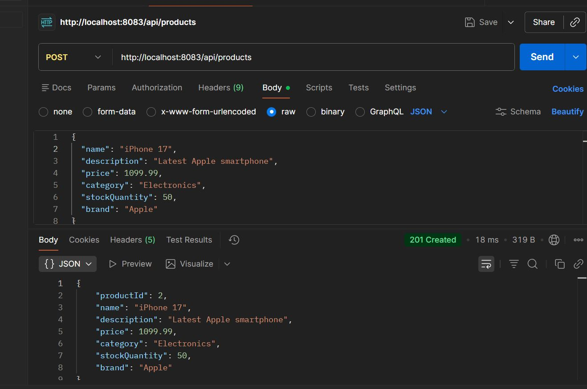
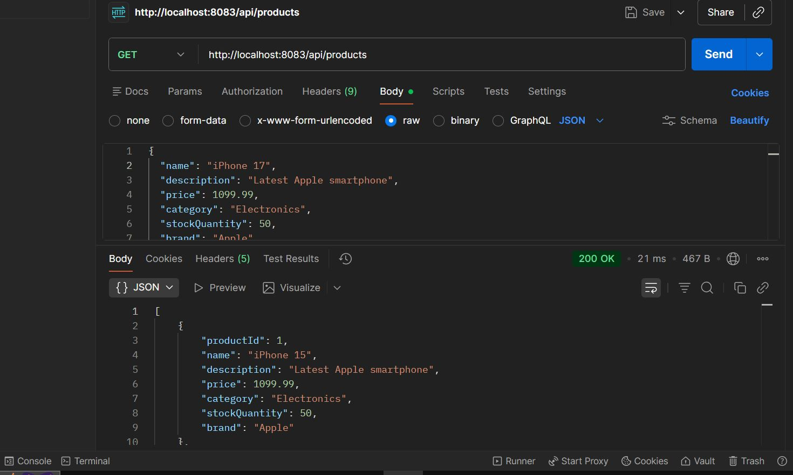
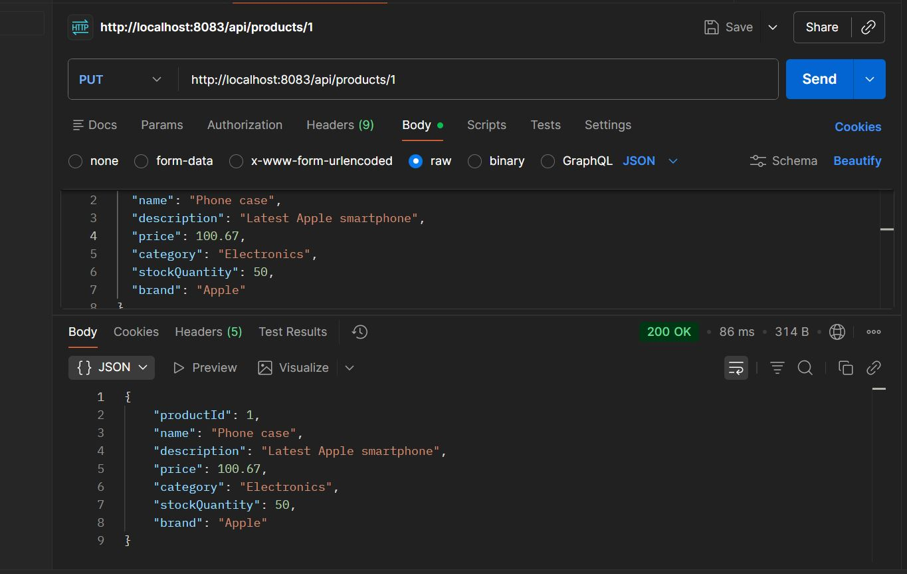
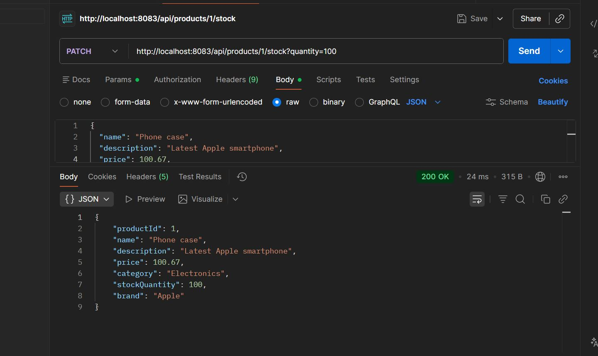
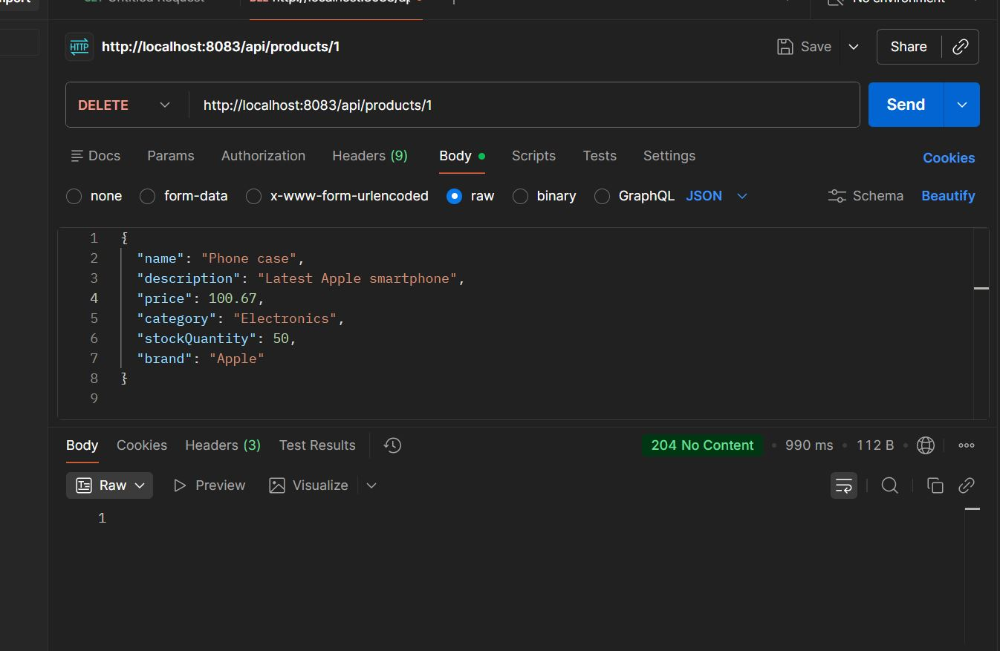

# Product Catalog REST API - CRUD Operations

A Spring Boot REST API for managing product catalog with full CRUD operations using PostgreSQL database and JPA.

## Features

- Complete CRUD operations (Create, Read, Update, Delete)
- PostgreSQL database integration
- JPA/Hibernate for data persistence
- RESTful API endpoints
- Pagination support
- Advanced filtering (category, brand, price range, stock)
- Search functionality

## Technologies

- Java 21
- Spring Boot 4.0.2
- Spring Data JPA
- PostgreSQL
- Maven

## Database Configuration

```properties
spring.datasource.url=jdbc:postgresql://localhost:5432/ecommerce_db
spring.datasource.username=postgres
spring.datasource.password=1234
spring.jpa.hibernate.ddl-auto=create
server.port=8083
```

## API Endpoints

### Create Product (POST)
**Endpoint:** `POST /api/products`

**Request Body:**
```json
{
  "name": "iPhone 15",
  "description": "Latest Apple smartphone",
  "price": 1099.99,
  "category": "Electronics",
  "stockQuantity": 50,
  "brand": "Apple"
}
```



---

### Get All Products (GET)
**Endpoint:** `GET /api/products?page=0&limit=5`



---

### Update Product (PUT)
**Endpoint:** `PUT /api/products/{id}`

**Request Body:**
```json
{
  "name": "iPhone 15 Pro",
  "description": "Updated description",
  "price": 1199.99,
  "category": "Electronics",
  "stockQuantity": 30,
  "brand": "Apple"
}
```



---

### Get After Update
**Endpoint:** `GET /api/products/{id}`


---

### Update Stock (PATCH)
**Endpoint:** `PATCH /api/products/{id}/stock?quantity=100`



---

### Delete Product (DELETE)
**Endpoint:** `DELETE /api/products/{id}`



---

### Get After Delete
**Endpoint:** `GET /api/products/{id}`


---

## Additional Endpoints

- **Get by Category:** `GET /api/products/category/{category}`
- **Get by Brand:** `GET /api/products/brand/{brand}`
- **Search:** `GET /api/products/search?keyword={keyword}`
- **Price Range:** `GET /api/products/price-range?min={min}&max={max}`
- **In Stock:** `GET /api/products/in-stock`

## Setup Instructions

1. **Clone the repository**
   ```bash
   git clone https://github.com/KUNDWA1/Divine-MUTUYIMANA_26855.git
   cd Divine-MUTUYIMANA_26855
   git checkout crud_operation_assignment3
   ```

2. **Configure PostgreSQL**
   - Create database: `ecommerce_db`
   - Update credentials in `application.properties`

3. **Run the application**
   ```bash
   mvn clean spring-boot:run
   ```

4. **Test with Postman**
   - Import the endpoints
   - Base URL: `http://localhost:8083`

## Project Structure

```
Question3/
├── src/
│   └── main/
│       ├── java/com/example/demo/
│       │   ├── controller/
│       │   │   └── ProductController.java
│       │   ├── model/
│       │   │   └── Product.java
│       │   ├── repository/
│       │   │   └── ProductRepository.java
│       │   └── RestfullApiAssignmentApplication.java
│       └── resources/
│           └── application.properties
├── Screenshots/
└── pom.xml
```

## Author

Divine MUTUYIMANA - 26855
